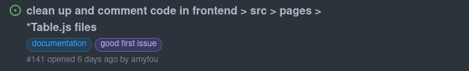
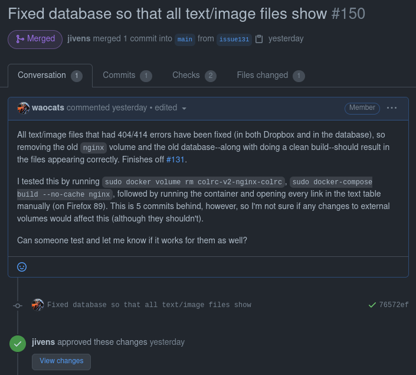

# colrc-v2
Coeur d'Alene Online Language Resource Center Version 2.0

[](https://travis-ci.org/arizona-linguistics/colrc-v2)

## Table of Contents
  
- [Getting Started](#getting-started)
  - [Requirements](#requirements)
  - [First Installation](#first-installation)
  - [Subsequent Pulls](#subsequent-pulls)
  - [Cleanup](#cleanup)
- [Working with Git](#working-with-git)
  - [The GitHub Workflow](#the-github-workflow)
    - [Checkout](#checkout)
    - [Add](#add)
    - [Commit](#commit)
    - [Push](#push)
  - [Working in this Repository](#working-in-this-repository)
- [About](#about)
  - [Frontend](#frontend)
  - [Backend](#backend)
  - [Postgres](#postgres)
  - [Testing](#testing)
    - [Frontend](#frontend-1)
    - [Backend](#backend-1)

## Getting Started

Our recommended development environment can be easily launched using [`docker-compose`](https://docs.docker.com/compose/install/). Note that when we refer to 'the command line,' we mean the *WSL/Linux/Mac command line* (not Windows Powershell, nor the Windows-native terminal app).

Here are the steps we recommend to start (as of 2/28/2023). If this is your first time using the development environment, read the [requirements](#requirements) below and the [first installation](#first-installation) steps. If you are reinstalling or trying to integrate new changes, see the [subsequent installation](#subsequent-installations) steps.

### Requirements

Install these applications in the appropriate format for your machine (Windows, Mac or Linux).  Windows users should ensure that they are using the 'education' or 'enterprise' editions of WindowsOS, the 'home' editions do not fully support WSL.  
- You will need sudo/root access on your system at the command line.
- [`docker`](https://docs.docker.com/install/)
- [`docker-compose`](https://docs.docker.com/compose/install/)
- [`git`](https://git-scm.com/downloads)
- [`python3`](https://www.python.org/downloads/)
- [`node`](https://nodejs.org/en/download/)
- If you are running Windows, you'll need to use [`WSL`](https://docs.microsoft.com/en-us/windows/wsl/install-win10) with [`Debian`](https://wiki.debian.org/InstallingDebianOn/Microsoft/Windows/SubsystemForLinux) 
- - once you have Debian installed, you will need to run `sudo apt-get update` and then `sudo apt-get upgrade`
- - you will also want to be sure you configure [`Docker Desktop to connect with WSL`](https://docs.docker.com/desktop/windows/wsl/)
- We recommend using [`VSCode`](https://code.visualstudio.com/) as your code editor for this project.

## First Installation

You will do these steps at a command line - windows users will use the WSL/Debian command lime; Mac and 
Linux users will use your regular terminal application.

1. Create and/or switch to the directory where you want our application to live. Then, from the command line in that directory, clone or pull this repository:

    `git clone https://github.com/arizona-linguistics/colrc-v2`

2. Afterward, change to the newly-created directory and pull to make sure you have all of the current changes to the repository.  Note that the default branch, "main," is the branch you should clone and/or pull.

    `cd colrc-v2 && git pull`
 
3. Create the external directories needed to run Odinson: Move up one directory, `cd ..`, and create a new directory named 'data' `mkdir data`.  
Move into the new directory, `cd data`, and make another directory called 'odinson', `mkdir odinson`. 

Move back to the root of the colrc-v2 directory, `cd ..` to move up one level, then `cd colrc-v2` to move into the root of the colrc-v2 dirctory.

4. Create your docker override yml file.  The purpose of this file is to tell our application where your external 
Odinson directory lives, so that it can map a drive to that directory.  The override file will not be copied back into 
the public git repo, as it will have information in it that's specific to you.

You will make a new file at the command line: `touch docker-compose.override.yml`, OR open your VS Code editor from the 
command line by typing `code .`. This command will open VSCode in the directory where you are 
currently working, so you'll be able to see all the files there and manipulate them.  If you open VSCode, you
can right or control-click on the Explorer view and select 'new text file', and save the new file as `docker-compose.override.yml`.

No matter how you created the file, copy and paste the following code block into the file.  Then
change the [yourfilepath] to match your path to the data/odinson directory.  If you're not
sure what yourfilepath is, you can type `pwd` (print working directory) at the command line to
reveal your current location.


```
services:
  odinson-rest-api:
    volumes: 
      - /[yourfilepath]/data/odinson:/data/odinson
```


5.  At the command line, build our development environment. Depending on your configuration, you may or may not need to `sudo`  The initial build may take a while, but subsequent builds will go faster.
    
    `docker compose -f docker-compose.yml -f docker-compose.override.yml up --build`
    

6. Once the build has finished, download our image/audio files from Dropbox. As files are updated in our Dropbox folder, you can run the script below while the development environment is down to keep your local filesystem up to date.
  
      If you do not have the [`requests`](https://docs.python-requests.org/en/master/user/install/#install) library, you will need to install it:
      
      `pip3 install requests` or `python3 -m pip install requests`
      
      If you already have it or you have finished installing `requests`, you can run the script using the command below:

      `python3 misc/dropbox-sync.py`
      
      If you get a permissions error when running the script, you can use the command below to fix the permissions you need (if the file/folder that has the permissions issue is different, substitute `file_data` with that file/folder):
      
      `sudo chown -R $USER file_data`

7. Then you may finally start our development environment as a background process!

    `docker compose -f docker-compose.yml -f docker-compose.override.yml up`

    Note that it may take a tiny bit after the command has completed in order for the environment to be fully up and running. To see if it is ready to go, check http://localhost:3000 and make sure you can see the website before proceeding!
    
8.  When you want to bring the system down, you can either use control-C from the terminal where the application is running; or use the 'down' button to the right of the container in Docker Desktop's gui, or you can open a new terminal, navigate to the root of the project, and use this command:

    `docker compose down`
    
    To relaunch for a new work session, if you haven't done a new pull from the repo, you can just 'up' the system without rebuilding it like this:

    `docker compose -f docker-compose.yml -f docker-compose.override.yml up`
    
    To relaunch after a new pull or significant local changes to i.e. the backend, you can build and then up like this:

    `docker compose -f docker-compose.yml -f docker-compose.override.yml up --build`


### Subsequent Pulls
As we progress in development, this repository will change. To get the most recent version of the repository, you will need to pull from the main branch. You will need to take a look at the most recent commits to see whether there have been changes to [`colrc.sql`](./misc/sql/colrc.sql) (which is the file that defines the database, including table permissions and relations via Hasura). Then:  

1. Make sure that the development environment is currently not running:
    
    `docker-compose down`
    
2. If there have been changes to [`colrc.sql`](./misc/sql/colrc.sql) since your last pull, delete the database's data folder:

    `sudo rm -rf misc/db_data`

3. Pull the changes from the main branch:
  
    `git checkout main && git pull`
  
4. Follow the first installation steps starting from [step 3](#step-3).

### Cleanup

To easily remove old volumes and containers, you can run [`./cleanup.sh`](./cleanup.sh) from the base directory.

## Working with Git

This section will serve as a tutorial on how to use Git/GitHub, as well as a guide regarding our specific workflow in this repository.


### The GitHub Workflow
In short, the basic GitHub workflow is `checkout > add > commit > push`, and work is done on a `branch` before it is merged into the `main` part of the repo. This workflow is described more in detail below.  As you begin to develop code, please make sure that you create and checkout a git branch that is named for the issue that you're working on.  We use the issue number as at least part of the branch name so that we can better track which branches address which issues.

#### Checkout
- `git checkout <branch>` switches your branch to the one you specified, and `git checkout -b <new-branch> <starting-point>` will make a new branch and switch to it, using another branch as a starting point (which is typically the main branch).

- Branches allow us to make changes separately and merge them when we are ready, rather than having your code constantly be changed by someone else from underneath you.

#### Add
- After you have changed a file, you can run `git add <file>` to add a file to your future commit (these files are now in what is called the *staging area*). To remove a file from the staging area, you may run `git reset <file>`.
  - A commit contains all of the changes that you (or others) add, and is like a snapshot of the repository's state at that time. This allows us to keep track of changes that are made in an efficient manner.

#### Commit
- Once you have made all of the changes that you want to make for a particular issue/subset of issues, you can run `git commit -m "<message>"` to make a commit for these changes.

- To see what a commit/commit message should look like, take a look at previous commits in this repository. Your changes in a commit should be somewhat related to each other, so that way your message is succinct and changes are easier to track.

#### Push
- Once you are ready to send your commit(s) to the GitHub repository, you may run `git push origin <branch>` to publish your changes.
  - Note that while you may reverse your changes on your local branch if you make a mistake (for example, `git reset HEAD~1` will undo your most recent commit), it is very frowned upon to do this after your changes have been already pushed. Before you push, make sure you have made any corrections that you want to make first.

#### If you change the database (tables or permissions)
- Produce a dump of the database with Hasura metadata included. 
- Change directory to the root of the repo.  
- Start the container if it's not already running, dump the database, and shut it back down.

  `sudo docker-compose up -d`

  `cd <rootOfRepo>`
  
  `cd colrc-v2/misc/sql && pg_dump -Cc -U postgres -h localhost colrc > colrc_new.sql`
  
  `Password: (get the pwd from the team)`
  
  `sudo docker-compose down`

- Open colrc_new.sql and
 
- Change "DROP DATABASE colrc" to 

  `DROP DATABASE IF EXISTS colrc`
  
- If you are using pg_dump v13+, also change "LOCALE = 'en_US.utf8';" to 

  `LC_COLLATE = 'en_US.utf8' LC_CTYPE = 'en_US.utf8';`
 
- Once you have verified that all looks well in the dump, you can overwrite the previous

   `mv colrc_new.sql colrc.sql`

- Then commit your changes and push to the repo.

### Working in this Repository
In order to address an issue with the code (which may be an unimplemented feature, a bug, or something which may need to be rewritten), first check the [issues](https://github.com/arizona-linguistics/colrc-v2/issues) page of the repository. Here you will find a list of issues that you can work on.

For example, say you choose the issue below:


Here is how you would go about addressing this issue:

1. Open the issue and look at the instructions. Once you have finished reading them, make sure you have the latest changes to the repository:

    `git pull`
    
2. Then, make a new branch for the issue based off of our main branch:

    `git checkout -b issue141 main`

3. For every set of changes, add and commit them with a message explaining what you changed--for example:
    
    `git add frontend/pages/AffixTable.js frontend/pages/AudioTable.js`
    
    `git commit -m "Added comments for documentation"`

4. Once you are ready and satisfied with your changes, push them to GitHub:
   
   For the first push: `git push -u origin issue141`

   Subsequent pushes: `git push origin issue141`

5. When you have completed the issue and you think the changes are ready to be implemented, go to the [pull requests](https://github.com/arizona-linguistics/colrc-v2/pulls) page and submit a new pull request from your branch to the main branch.

    When you make a pull request, it is important to explain the following:
   - What changes you made 
   - What issue your changes fixed
   - How your changes were tested

    Below is a sample pull request that includes these elements:
   
    

## About

The following sections discuss the components we are using for this project, along with ways you can access them.

### [Frontend](./frontend)

The frontend is built using [`react`](https://reactjs.org/).  If you've launched the development environment using [`docker-compose`](https://docs.docker.com/compose/install/), the app will launch on http://localhost:3000.  Changes you make to the frontend source will update in realtime.


### [Backend](./backend)

The backend is a [`Node`](https://nodejs.org/en/) app that currently relies on [`Express`](https://expressjs.com/), [`sequelize`](https://github.com/sequelize/sequelize), [`Hasura GraphQL`](https://hasura.io/), and [`Postgres`](https://www.postgresql.org/).  If you've launched the development environment using [`docker-compose`](https://docs.docker.com/compose/install/), any changes you make to the [backend source](./backend) are monitored with [`nodemon`](https://www.npmjs.com/package/nodemon), and will trigger a rebuild whenever detected.

You can access the [Hasura GraphQL Console](https://hasura.io/blog/tagged/console/) by going to http://localhost:8080 in your browser.


### Postgres

Postgres may be accessed directly by running:
```
docker exec -it "colrc-v2-postgres-db" psql -d colrc -U root -W
```

See [`.env`](./.env) for the credentials used to launch the development version of the service.

Place `.sql` files in [`misc/sql`](./misc/sql) to have them loaded when Postgres (v12) first launches.


### Testing

We suggest testing using the environment launched by [`docker-compose`](https://docs.docker.com/compose/install/). Both frontend and backend tests are written using [`jest`](https://jestjs.io/):

#### Frontend
    
```
docker exec -it "colrc-v2-frontend" npm run test
```

#### Backend

```
docker exec -it "colrc-v2-backend" npm run test
```
